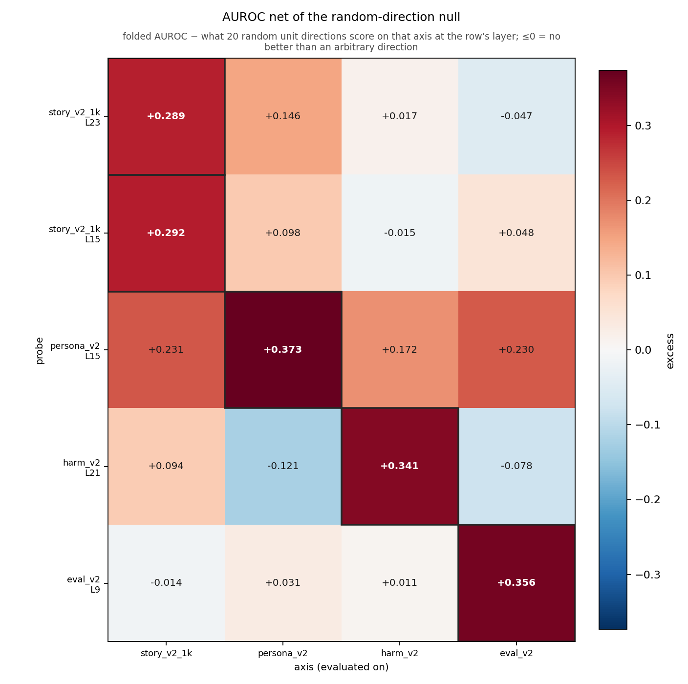

# cross_probe_detection — insights

## 50_per_direction

Qwen2.5-7B-Instruct, band L11–25, 65 pooled pairs per axis (30 for `length`). 

Own-best layer = peak `mean_paired_cos` on train, in band: 
- `story_v2` L16, 
- `story_v1` L16, 
- `harm` L21, 
- `persona` L12,
- `eval` L14, 
- `length` L13. 

All numbers below are band means unless stated.

### The AUROC matrix is saturated and cannot answer H1

Rows = probe, `*` = diagonal (LOPO, n=50):

| probe | story_v2 | story_v1 | harm | persona | eval | length |
|---|---|---|---|---|---|---|
| story_v2 | 1.000\* | 1.000 | 0.676 | 0.643 | 0.412 | 0.247 |
| story_v1 | 1.000 | 1.000\* | 0.289 | 0.742 | 0.382 | 0.269 |
| harm | 0.800 | 0.516 | 0.987\* | 0.550 | 0.529 | 0.751 |
| persona | 0.832 | 0.880 | 0.472 | 1.000\* | 0.768 | 0.958 |
| eval | 0.242 | 0.149 | 0.583 | 0.933 | 0.949\* | 1.000 |
| length | 0.216 | 0.217 | 0.609 | 0.966 | 0.845 | 1.000\* |
| random | 0.527 | 0.518 | 0.517 | 0.479 | 0.488 | 0.480 |

### The geometry can, and says the axes are distinct

| pair                | cos         |
| ------------------- | ----------- |
| story_v2 – story_v1 | **+0.759**  |
| eval – length       | +0.259      |
| persona – length    | +0.245      |
| persona – eval      | +0.227      |
| story_v1 – persona  | +0.127      |
| harm – length       | +0.101      |
| story_v2 – persona  | +0.093      |
| story_v2 – harm     | **+0.055**  |
| the other 7 pairs   | −0.08…+0.03 |

### Findings

- **H1 holds geometrically.** `story_v2` keeps 98% of its norm outside span{harm, persona, eval,
  length} and its cosine to each is ≤ 0.093 — while the same pairs read 0.64–0.80 in the matrix.
- **`story_v2` – `harm` is the cleanest orthogonality in the study** (cos +0.055) and still reads
  0.80 AUROC. That single cell is the whole argument against the AUROC matrix.
- **`story_v2` ≈ `story_v1`, not =**: cos +0.76, 65% of v1 outside v2. 

---

## 1K_per_direction

Qwen2.5-7B-Instruct, 1,000 pooled pairs per axis, one chosen layer per direction:
`story_v2_1k` L23, `persona_v2` L15, `harm_v2` L21, `eval_v2` L9. Each probe is read at **its own**
layer, so the matrices are not symmetric. No LOPO — the diagonal is the deployed 800-pair vector on
its 200 held-out pairs.

### AUROC and Cohen's d_z at the chosen layers

Rows = probe at L_row, `*` = diagonal (held-out 200). `null` is what 20 random unit directions
already score (folded) on that axis and layer — it, not 0.5, is the reference.

| probe (L) | story_v2_1k | persona_v2 | harm_v2 | eval_v2 |
|---|---|---|---|---|
| story_v2_1k (23) | **1.000\*** / +3.74 | 0.794 / +0.79 | 0.684 / +0.44 | 0.459 / −0.11 |
| persona_v2 (15) | 0.939 / +1.56 | **1.000\*** / +2.45 | 0.193 / −0.70 | 0.825 / +0.88 |
| harm_v2 (21) | 0.855 / +1.06 | 0.452 / −0.06 | **0.985\*** / +1.47 | 0.514 / +0.03 |
| eval_v2 (9) | 0.340 / −0.40 | 0.734 / +0.65 | 0.422 / −0.10 | **0.950\*** / +1.55 |
| *null (folded)* | *0.72* | *0.67* | *0.66* | *0.59* |

Only 3 of 12 off-diagonal cells clear δ=0.60, and 4 read their rival **worse** than a random
direction does. Net of the null the largest leakage is `persona_v2` → `story_v2_1k` (+0.231) — the
AUROC matrix is as uninformative at n=1000 as at n=65.

**Cohen's d_z is what the extra pairs bought.** The diagonal spans 1.47–3.74 where AUROC spans
0.950–1.000, so d_z ranks the axes (`story_v2_1k` ≫ `persona_v2` > `eval_v2` ≈ `harm_v2`) where
AUROC cannot. Off-diagonal it also separates sign from magnitude: `persona_v2` → `harm_v2` is
AUROC 0.193 / d_z −0.70, i.e. a strong *inverted* read, not a null.

**Dropping LOPO cost nothing**: the deployed vector on its 200 unseen pairs reproduces the LOPO
diagonal to ≤0.015 AUROC and ≤0.05 d_z, and most of that gap is the 200-vs-800 sample rather than
the refit — as `extraction`'s ~0.005 d_z estimate predicted.

### Net of the null, the diagonal barely stands out

`excess_over_null` = folded AUROC − what 20 random unit directions get on that axis and layer:

| probe (L)        | story_v2_1k | persona_v2 | harm_v2    | eval_v2    |
| ---------------- | ----------- | ---------- | ---------- | ---------- |
| story_v2_1k (23) | **+0.289**  | +0.146     | +0.017     | −0.047     |
| persona_v2 (15)  | +0.231      | **+0.373** | +0.172     | +0.230     |
| harm_v2 (21)     | +0.094      | −0.121     | **+0.341** | −0.078     |
| eval_v2 (9)      | −0.014      | +0.031     | +0.011     | **+0.356** |

- **The diagonal tops out at +0.29…+0.37**, so a fitted probe beats an arbitrary direction on its own
  axis by less than 0.4 AUROC. This is the same point as `rand±` in `extraction`: paired AUROC
  credits contrast consistency, not the vector.
- **`persona_v2` is the one leaky probe** — its whole row is positive (+0.17…+0.23), and its best
  off-diagonal (+0.231) sits only 0.06 below `story_v2_1k`'s own diagonal (+0.289). Its cosines to
  those axes are +0.170 / −0.051 / +0.081, so the leakage is not geometric: it reads `harm_v2` at
  +0.172 excess from a direction that is orthogonal to it.
- **`eval_v2`'s row is flat at the null** (−0.014…+0.031) and `harm_v2`'s is at or below it except a
  small +0.094 on story — those two read nothing but themselves.

### Geometry — the axes are distinct

Split-half floor at 800 pairs: `story_v2_1k` +0.997, `harm_v2` +0.992, `persona_v2` +0.991,
`eval_v2` +0.968 (reliab. ≥0.98). Null band ±0.050. Cosines with the row vector re-read at the
column's layer:

| | story_v2_1k L23 | persona_v2 L15 | harm_v2 L21 | eval_v2 L9 |
|---|---|---|---|---|
| story_v2_1k | 1.000 | +0.137 | +0.074 | −0.052 |
| persona_v2 | +0.170 | 1.000 | −0.051 | +0.081 |
| harm_v2 | +0.040 | **−0.240** | 1.000 | −0.016 |
| eval_v2 | −0.012 | **+0.296** | +0.078 | 1.000 |

Residual of each axis outside span{the other three}, band mean: `story_v2_1k` 0.982, `harm_v2`
0.975, `eval_v2` 0.943, `persona_v2` 0.917. Against `story_v2_1k` alone: 0.989–0.999.

### Findings

- **H1 holds at n=800, more cleanly than at n=50.** Every off-diagonal cosine is ≤0.30 against a
  floor of 0.97–1.00, and `story_v2_1k` keeps 98% of its norm outside the other three — while the
  same pairs read 0.68–0.94 AUROC. Geometry and the matrix disagree exactly as at 50 pairs.
- **`persona_v2` – `eval_v2` is the one real off-diagonal** (cos +0.296, mutual AUROC 0.83 / 0.73).
  Both are framing axes over the same task pool, so this is the pair to watch downstream.
- **`harm_v2` – `persona_v2` is −0.240**, i.e. *anti*-aligned, despite 8% verbatim prompt overlap —
  the overlap cannot be what produces it.
- **`story_v2_1k` is the most isolated axis**: max |cos| to any rival 0.170, residual 0.982.
- **The two cosine conventions differ by ~5×** (story–persona +0.032 own-layer vs +0.137/+0.170
  matched). Most of that is the vectors sitting 8 layers apart, not extra orthogonality, so
  `cos_own` must not be quoted as the stronger H1 result — read `cos_matched`.
- **The matrix is asymmetric where the layers are far apart**: `persona_v2` reads story at 0.939 but
  story reads persona at 0.794, purely because L15 and L23 are different read positions.

### Caveats

- **No positive control at this tag.** `story_v1` is absent, so no cell is *supposed* to read high;
  a matrix of nulls is not self-validating here.
- `eval_v2`'s L9 is outside the reporting band L11–25, so its band columns and its null are not
  measured where its cells are.
