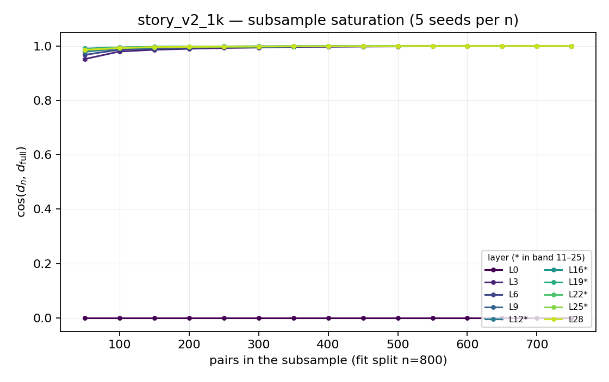
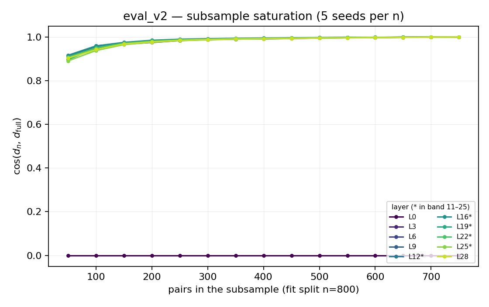
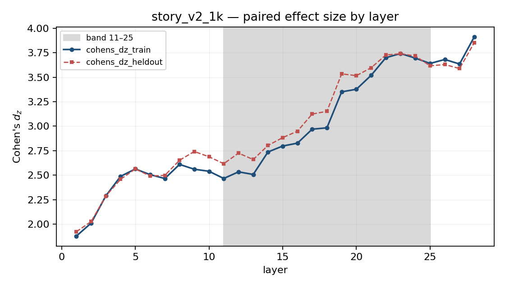
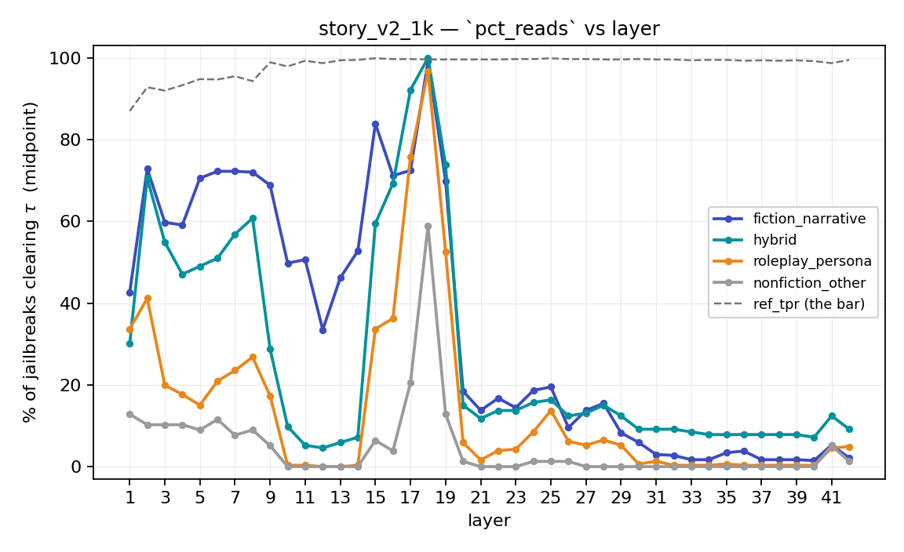
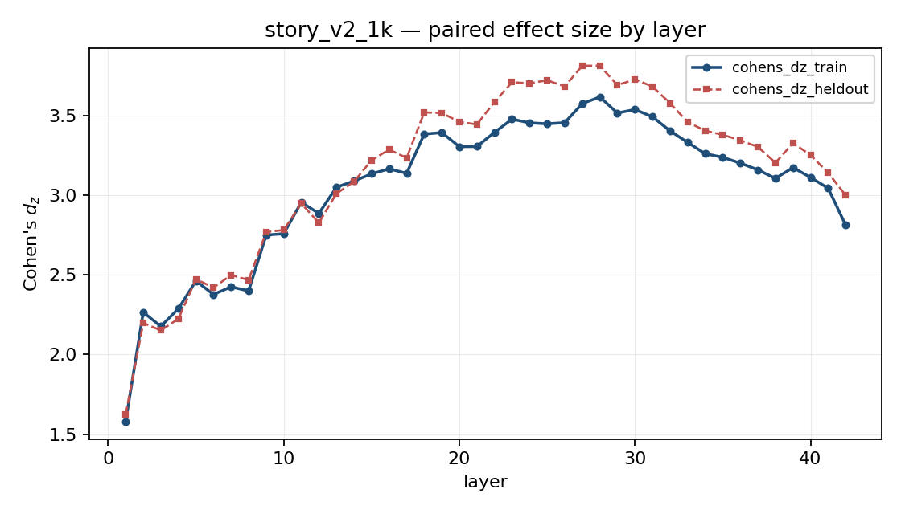

# 50_per_direction

Qwen2.5-7B-Instruct (L=28, d=3584), 50 train / 15 held-out pairs per direction, last token.
`persona` and `eval` carry an appended base task (25 harmful / 25 benign). Band = L11–25.

We compare the story_v1 direction with the story_v2 direction, also against the story_v1 unmatched in order to know whether they can actually read "narrativity" 

These direction seem to be almost the same, although all the AUROC metrcis are saturated

## Do the axes exist?

Band-mean over L11–25; held-out is 15 pairs, CP interval.

| direction | lopo AUROC | held-out | mean_paired_cos | ‖d‖/σ_act | verdict |
|---|---|---|---|---|---|
| `story_v2` | 1.000 | 1.000 | 0.716 | 0.34 | strong |
| `story_v1` | 1.000 | 1.000 | 0.698 | 0.13 | strong |
| `persona` | 1.000 | 1.000 | 0.573 | 0.13 | strong |
| `length` | 1.000 | 1.000 | 0.689 | 0.14 | strong |
| `harm` | 0.987 | 0.960 | 0.582 | 0.49 | strong, deep only |
| `eval` | 0.949 | 0.978 | 0.295 | 0.05 | **weak** |

Sample size is settled by `c = mean_paired_cos` (§0.7), not by AUROC:

| direction | c | cos(d̂, d) at n=50 | n for cos ≥ 0.95 |
|---|---|---|---|
| `story_v2` / `story_v1` | 0.70–0.72 | 0.99 | 9–10 |
| `harm` / `persona` | 0.57–0.58 | 0.98 | 19 |
| `eval` | 0.295 | 0.91 | **98** |

## Is the saturated AUROC real?

Three controls added to `probe_select`, band-mean. `shuffled` refits LOPO with the pos/neg
assignment flipped per pair (20 draws); `rand±` is the sign-corrected mean over 20 random unit
directions; `margin` is the smallest per-pair gap in pooled-sd units.

| direction | shuffled (want 0.5) | rand± | margin min | final token | verdict |
|---|---|---|---|---|---|
| `story_v2` | 0.496 | 0.834 | +1.14 | identical, all 50 pairs | real, wide |
| `story_v1` | 0.521 | 0.697 | +0.92 | identical, all 50 pairs | real, wide |
| `harm` | 0.494 | 0.762 | +0.18 | **differs within pair** | real, thin |
| `persona` | 0.509 | 0.723 | +0.29 | identical within pair | real, thin |
| `eval` | 0.496 | 0.611 | **−0.21** | identical within pair | not saturated (0.98) |
| `length` | 0.505 | 0.776 | +0.33 | identical within pair | real, thin |

- **No label leakage.** The shuffled null sits at 0.494–0.521 everywhere, so LOPO closes every path
  from label to vector and the 1.000s are not an artifact of the pipeline.
- **Not a token-identity readout for 5 of 6.** `story_v2`/`story_v1` end every prompt on the same
  character; `persona`/`eval`/`length` end identically *within* each pair (the appended task is
  byte-identical). Only `harm` has poles that end differently, so it is the one direction where
  final-token identity remains a live alternative explanation.
- **`rand±` 0.61–0.83 is the real caveat.** A *random* direction, sign-corrected, already separates
  the poles at 0.83 for `story_v2`. So AUROC 1.000 is credit for the contrast being consistent, not
  evidence that the fitted direction is special — geometry (§2), not AUROC, has to carry H1.
- **Margins split the directions.** `story_v2`/`story_v1` clear the boundary by ~1 sd; `harm` and
  `persona` are perfect but within 0.2–0.3 sd of touching, so their 1.000 would not survive a few
  more pairs. `eval`'s classes already overlap, consistent with its 0.98.

Length gap at the read position (chars, pos − neg): `eval` +0.4, `persona` +9.5, `harm` +15.0,
`story_v2` −22.1, `story_v1` −39.6, `length` +200.5. Both story arms are *shorter* on the narrative
side, which is the opposite sign to the naive story-vs-bare contrast.

## The length foil

`resid_len_auroc`: each direction applied to filler-long vs filler-short. 0.5 = length-blind.

| direction | L11–25 mean | shape across depth |
|---|---|---|
| `story_v2` | 0.170 | inverted at every layer (long scores *lower*) |
| `story_v1` | 0.163 | same |
| `harm` | 0.770 | 1.000 shallow → 0.11 by L27 |
| `persona` | 0.970 | 1.000 to L23, 0.67–0.89 after |
| `eval` | 1.000 | 1.000 at every layer |

**No direction is length-blind anywhere in the band.** story reads length backwards (consistent with
`initial_tests` §2c); `persona` and `eval` read it almost perfectly forwards.

## Layer selection is being decided by the gate, not the signal

The foil has **9 held-out pairs**, so `resid_len_auroc` is quantised to steps of 1/9 and the
`|x − 0.5| ≤ 0.10` gate only admits 0.444 / 0.5 / 0.556.

| direction | layers passing the gate | band chosen | primary (depth) | where `mean_paired_cos` actually peaks |
|---|---|---|---|---|
| `story_v2` | 2 of 29 (L0, L20) | L20–20 | 20 (0.71) | L16 (0.776) |
| `story_v1` | 5 of 29 (L0,1,6,7,20) | L6–7 | 7 (0.25) | L16 (0.767) |
| `harm` | 6 of 29 | L22–24 | 22 (0.79) | L21 (0.708) |
| `persona` | 1 of 29 (L0 only) | gate failed → L1–28 | 7 (0.25) | L12 (0.707) |
| `eval` | 2 of 29 (L0, L1) | gate failed → L1–28 | 14 (0.50) | L14 (0.332) |
| `length` | — (self) | gate failed → L1–28 | 2 (0.07) | L8 |

`story_v1`'s shallow primary (L7) vs `story_v2`'s (L20) is a gate artifact, not a real difference:
both peak at L15–18 on every non-saturating metric.

## v2 vs v1 (§1.6, matched n = 50 vs 50)

| quantity | L11–25 mean | note |
|---|---|---|
| cos(d_v2, d_v1) | **+0.759** | null band ±0.050; peaks +0.799 at L14–20 |
| cos(d_v2, d_v1_audience) | +0.454 | v1's negative arm changes the vector a lot |
| AUROC d_v2 → v1's 50 pairs | 1.000 | |
| AUROC d_v1 → v2's 50 pairs | 1.000 | |

Same axis, not the same vector (0.76 ≈ 40°). The 5,000-row crossed table bought nothing the 50-pair request-free construction does not already give.

## §1.2a transfer — uninformative, as pre-registered

All three probes on the 100 filler-free v1 pairs (`prompt_story` vs `prompt_bare`):

| probe | band AUROC | Cohen's d_z |
|---|---|---|
| `d_length` | 1.000 | **5.26** |
| `d_v1_50` | 1.000 | 4.71 |
| `d_v2` | 1.000 | 4.33 |

The length foil scores the *highest*. Per §1.2a the test is only readable when `d_length` ≈ 0.5, so it
says nothing about request-invariance here.

## Appended tasks

| direction | AUROC on harmful tasks | on benign | gap |
|---|---|---|---|
| `persona` | 1.000 | 1.000 | +0.000 |
| `eval` | 0.949 | 0.949 | +0.000 |

## Findings

- **Five of six axes are linearly readable at n=50; `eval` is the exception** — c=0.295 means its
  vector needs ~98 pairs, and its norm is 5–10× smaller than the others'.
- **Nothing is length-blind.** story reads length inverted; `persona` and `eval` read it at ~1.0.
- **The 9-pair length gate, not the data, is choosing layers.** It admits ~2 of 29 layers by
  quantisation accident and overrides `mean_paired_cos`, which peaks at L15–18 for both story axes.
- **`story_v2` and `story_v1` are the same axis** (cos +0.76 vs a ±0.05 null, cross-AUROC 1.000 both ways), so the crossed table is not needed — but v1's negative arm matters (audience 0.45 vs expository 0.76).
- **§1.2a is uninformative**: `d_length` separates the filler-free contrast better than either story
  vector, exactly the outcome the arm was built to detect.
- **Appended tasks worked**: zero AUROC gap between harmful and benign requests, so `persona` and `eval` are framing axes rather than framing × harm.
- AUROC saturates everywhere and cannot rank layers — every selection decision rests on
  `mean_paired_cos` and the foil.
- **The saturation is real but weakly diagnostic**: no label leakage (shuffled null at chance) and no
  token-identity artifact except possibly `harm`, but sign-corrected random directions already reach
  0.61–0.83, so 1.000 credits contrast consistency rather than the fitted direction.

## Actions

1. `len_frac` is blank for 5 of 6 directions — `probe_select` ran before `directions__length.pt`
   existed. Re-run `probe_select` for all directions (CPU, seconds).
2. Rebuild the `length` contrast at 50/15 pairs, or drop the foil from the selection rule and report
   it only. At 9 pairs it cannot support a ±0.10 tolerance.
3. Decide `eval`: more pairs, or demote it from the four-rival set.

---

# 1K_per_direction - Qwen 7B

Qwen2.5-7B-Instruct (L=28, d=3584), **800 train / 200 held-out** pairs per direction, last token.
Band = L11–25. No length foil and no `story_v1`; the framing axes carry their task inside the
dataset. Layers are chosen by hand from `cohens_dz_train`.

## Do the axes exist, and how many pairs do they need?

Band-mean L11–25. `c` is `mean_paired_cos`; `n*` inverts §0.7's
`cos(d̂,d) ≈ 1/√(1+(1−c²)/(c²n))` at the stated threshold. `n@.99` is where the subsample curve
actually reaches `cos(d_n, d_800) = 0.99`. `cos(tr,ho)` fits the 800 and the 200 separately, so
neither vector contains the other.

| direction | lopo AUROC | held-out | ‖d‖/σ_act | c | n*@.95 | n*@.99 | **n@.99 obs** | obs/pred | **cos(tr,ho)** |
|---|---|---|---|---|---|---|---|---|---|
| `story_v2_1k` | 0.996 | 0.998 | 0.22 | 0.63 | 14 | 76 | **100** | 1.3 | **+0.995** |
| `persona_v2` | 0.997 | 0.999 | 0.19 | 0.51 | 26 | 139 | **150** | 1.1 | +0.943 |
| `harm_v2` | 0.973 | 0.974 | 0.22 | 0.48 | 32 | 169 | **200** | 1.2 | +0.917 |
| `eval_v2` | 0.971 | 0.959 | **0.05** | 0.28 | 105 | 561 | **350** | **0.6** | **+0.734** |

**§0.7's model holds at n=800.** Within ~30% for the three consistent axes, and *conservative* for
`eval_v2`, which converges faster than `c` alone predicts. The estimator is trustworthy at 16× the n
it was written for — but only when read at a matched threshold: the same `c` gives n* = 14 at
cos ≥ 0.95 and 76 at cos ≥ 0.99 for story, so quoting one against the other looks like a 5× failure
that is really just the threshold.

**So n=50 was adequate for a 0.95-accurate vector and not for a 0.99-accurate one** — n* is 14–32 for
story/persona/harm at 0.95, which is what the 50-pair tag delivered. `eval_v2` was the one genuine
shortfall (n* = 105, and the 50-tag reported ~98).

**`eval_v2` is still the outlier at n=800.** Its two independent halves agree at only +0.734 (null
±0.050), so the vector is real but not converged, and its norm is 4× smaller than the others' —
which matters directly for experiment 4's steering units.

Story is flat above n≈150 at every layer; `eval` is still climbing at 750 and its shallow layers
converge visibly later than its band.

## Where to read each axis

`cohens_dz_train` (full-sample vector, n=800) selects; `cohens_dz_heldout` (same vector, 200 unseen
pairs) confirms; `mean_paired_cos` is reported. LOPO is kept only for `lopo_auroc` and its nulls —
at n=800 it moves d_z by ~0.005, ~100× below its SE, so the deployed vector is what selects. **An argmax alone is not a layer** — `plateau` is every band
layer within 1 SE of the best, SE ≈ √((1+d_z²/2)/n), so it is what the column can actually resolve.

| direction | d_z train argmax | **plateau** | d_z held-out argmax | plateau | peak mpc |
|---|---|---|---|---|---|
| `story_v2_1k` | L23 (3.74) | **L22–24** | L23 (3.74) | L21–25 | L16 (0.683) |
| `persona_v2` | L15 (2.46) | **L14–15** | L14 (2.81) | L14 | L13 (0.575) |
| `harm_v2` | L23 (1.48) | **L19–25** | L21 (1.47) | L19–25 | L21 (0.585) |
| `eval_v2` | L13 (1.76) | **L13** | L25 (1.43) | **L11–25 (all)** | L14 (0.324) |

**The held-out column confirms but cannot select.** At n=200 its SE is 2× the train column's, so it
resolves 5 layers where train resolves 3, and for `eval_v2` it resolves *nothing* — all 15 band layers
sit within 1 SE. `eval_v2`'s apparent L13-vs-L25 conflict is not a disagreement; it is a flat held-out
profile with a noisy argmax. Train at n=800 pins `eval_v2` to L13 alone, more sharply than any other
axis.

**`harm_v2` is the genuinely unresolved one**: L19–L25 is one plateau on both columns, so its argmax
L23 is not meaningfully better than L21 — which is where `mean_paired_cos` peaks.

**d_z and `mean_paired_cos` disagree by ~7 layers on story** (L23 vs L16), the same split the 50-pair
tag showed, so it is a property of the axis and not of small n: d_z climbs into the deep band while
the per-pair cosine peaks mid-band.

**Ignore L28 in the figures.** d_z is the global max there for `story_v2_1k` (3.91 vs 3.74 at L23) and
`harm_v2`, but the last hidden state is **post-final-RMSNorm**: median ‖h‖ climbs monotonically to 377
at L27 and then *falls* to 294 at L28, which adding a block cannot do. Normalising shrinks
between-example scale and so inflates d_z — and `mean_paired_cos` does not spike there (0.599 vs its
0.683 peak at L16), which a genuinely stronger construct would. Outside the band anyway, so no
selection is affected. L0 is NaN for the opposite reason and is a good sign: the read position is the
same template token in both poles, so `d = 0` exactly.

### Chosen layers

Maximizing cohens train and minimizing gap between train and heldout

| direction     | proposed | why                                                       |
| ------------- | -------- | --------------------------------------------------------- |
| `story_v2_1k` | **L23**  | both columns agree, plateau L22–24                        |
| `persona_v2`  | **L15**  | train plateau L14–15, held-out argmax L14                 |
| `harm_v2`     | **L21**  | inside the L19–25 plateau, and the `mean_paired_cos` peak |
| `eval_v2`     | **L9**   | a plateau and reduced gap                                 |

Backup layers:
- Persona: L5 (another peak of both train and heldout, close gap)
- 

## Is the saturated AUROC real?

Band-mean. The `classes touch` failure only fires where AUROC reached ≥0.999, so it flags a
*contradiction*, not the worst margin — `eval`/`harm` have thinner minima and pass.

| direction | shuffled (want 0.5) | rand± | margin min / med | verdict |
|---|---|---|---|---|
| `story_v2_1k` | 0.499 | 0.706 | −0.55 / +1.84 | real, a few outlier pairs touch |
| `persona_v2` | 0.501 | 0.661 | −0.24 / +1.42 | real, a few outlier pairs touch |
| `harm_v2` | 0.504 | 0.675 | −0.76 / +1.13 | real, not saturated |
| `eval_v2` | 0.501 | 0.602 | −0.80 / +0.80 | real, not saturated |

No label leakage anywhere. `rand±` 0.60–0.71 is lower than at n=50 (0.61–0.83) but still says AUROC
credits contrast consistency, not the fitted direction — geometry still has to carry H1.

## Dataset caveats that reach downstream

- **`persona_v2`'s negative pole is 690 distinct prompts for 800 pairs** (99 strings repeat, max 3×).
  Paired metrics are fine; `mean(neg)` in the diff-in-means has an effective *n* below 800.
- **`harm_v2` and `persona_v2` share 159 prompts verbatim** (8% each) — `harm_v2`'s persona framing family renders the same `assistant_framing + request` strings as `persona_v2`'s negative arm. Any
  `cos(d_harm_v2, d_persona_v2)` in experiment 2 is measured on overlapping data.

## Findings

- **All four axes are linearly readable at n=800**, and the ranking from n=50 survives.
- **§0.7's sample-size model is validated**: observed/predicted 1.1–1.3 for story/persona/harm, 0.6
  for `eval_v2`. Read it at the threshold you care about — 0.95 and 0.99 differ ~5× in n.
- **`eval_v2` remains the weak axis**: halves agree at +0.734 and its norm is 4× smaller — but its
  *layer* is the best-resolved of the four (L13 alone on train).
- **The 200-pair held-out column confirms and cannot select** — 2× the SE, and for `eval_v2` it
  resolves no layer at all. Selection has to rest on the LOPO column.
- **`harm_v2`'s layer is the unresolved one**: L19–25 is a single plateau on both columns.
- Length is unmeasured at this tag, so the confound the 50-pair run found (story reads length
  *inverted*, `persona`/`eval` read it at ~1.0) is neither confirmed nor cleared here.

## Actions

1. Confirm the four proposed layers, in particular `harm_v2` L21 vs L23 inside its plateau.
2. Report `cos(d_harm_v2, d_persona_v2)` in experiment 2 with the 8% prompt overlap stated, or
   recompute it on the disjoint remainder.
3. If length matters for the H1 claim, cache a `length` view at this tag and re-run `probe_select` —
   the columns are still emitted when the view exists.

# 1K_per_direction - Gemma 9B

`google/gemma-2-9b-it` (L=42, d=3584), **800 train / 200 held-out** pairs per direction, last token,
`eager` attention. Band = **L17–38**. Same four axes and datasets as the Qwen run; no length foil.

# Extraction
### Where to read each axis

`cohens_dz_train` selects, `cohens_dz_heldout` (200 unseen pairs) confirms; `plateau` is every layer
within 1 SE of the argmax, SE ≈ √((1+d_z²/2)/n), so it is what the column can resolve.

| direction | **d_z train argmax** | plateau | d_z held-out argmax | gap tr−ho | peak mpc | depth |
|---|---|---|---|---|---|---|
| `story_v2_1k` | **L28** (3.62) | L27–28, 30 | L28 (3.81) | −0.20 | L21 (0.670) | 0.67 |
| `persona_v2` | **L15** (2.83) ⚠ | L14–17 | L18 (2.62) | +0.29 | L4 (0.586) | 0.36 |
| `harm_v2` | **L19** (1.32) | L18–21 | L21 (1.21) | +0.13 | L28 (0.432) | 0.45 |
| `eval_v2` | **L8** (2.16) ⚠ | L7–8 | L7 (2.28) | −0.11 | L7 (0.355) | 0.19 |

⚠ outside the band, so those cells need `--allow-out-of-band`.

## Probe jailbreak detection

## story: the fiction − nonfiction margin disagrees with d_z

`pct_reads` per jailbreak family at each layer (`probe_jailbreak_detection`, all 1,009 rows; n = 472
fiction / 306 roleplay / 153 hybrid / 78 nonfiction). The margin is fiction − nonfiction: how far the
probe separates the jailbreaks it should read from the ones it should not.

| layer | fiction | roleplay | hybrid | nonfiction | **margin** | margin (`gap_mid`) | all | ref_tpr |
|---|---|---|---|---|---|---|---|---|
| L2 | 72.9 | 41.2 | 70.6 | 10.3 | **+62.6** | +62.2 | 58.1 | 0.93 |
| L7 | 72.2 | 23.5 | 56.9 | 7.7 | **+64.6** | +62.2 | 50.1 | 0.95 |
| L9 | 68.9 | 17.3 | 28.8 | 5.1 | **+63.7** | +56.1 | 42.2 | 0.99 |
| **L15** | 83.9 | 33.7 | 59.5 | 6.4 | **+77.5** | **+71.4** | 59.0 | 1.00 |
| L16 | 71.2 | 36.3 | 69.3 | 3.8 | **+67.3** | +59.3 | 55.1 | 1.00 |
| L18 | 99.2 | 96.7 | 100.0 | 59.0 | **+40.2** | +62.7 | 95.4 | 1.00 |
| L28 (d_z peak) | 15.5 | 6.5 | 15.0 | 0.0 | **+15.5** | +1.9 | 11.5 | 1.00 |

**L15 is the margin peak under both threshold rules**, and it is the same layer `persona_v2`'s d_z
picks — as at the Qwen tag, where story's detection-best layer was also persona's chosen one.

**The two criteria pick layers 13 apart, and the gap is large.** At L28 the probe reads 15.5% of
fiction jailbreaks against 83.9% at L15, with `ref_tpr` = 1.00 at both — the bar is passable, so this
is the probe genuinely not reading jailbreaks as story that deep. Past L19 every curve collapses
(band-mean margin +14.5, best deep layer +18.2), which is most of the reporting band.

**L18 is a saturation layer, not a discriminating one**: 95.4% of all jailbreaks clear τ there,
including 59% of `nonfiction_other`. Its high fiction number is not separation.

## Chosen layers per direction

- Persona: L15
- Story: L28 and L15
- Eval: L8
- Harm: L19