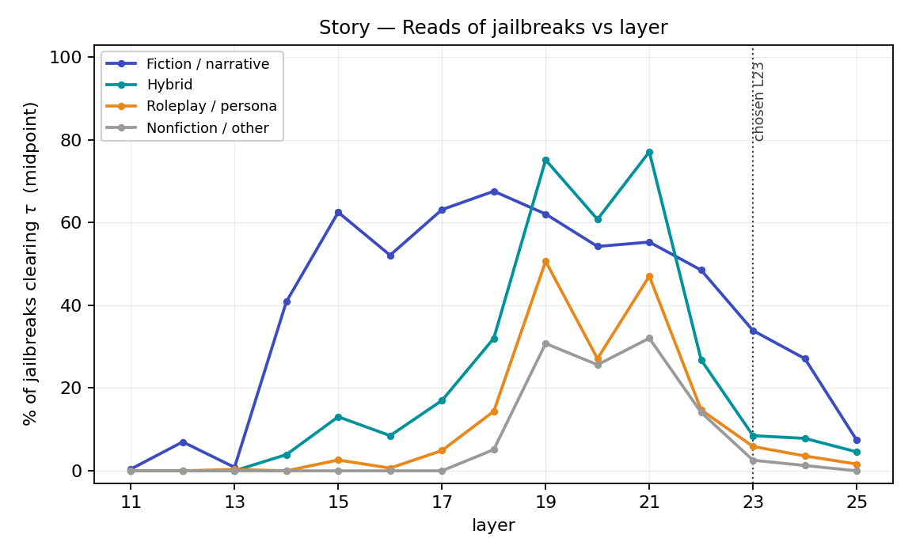
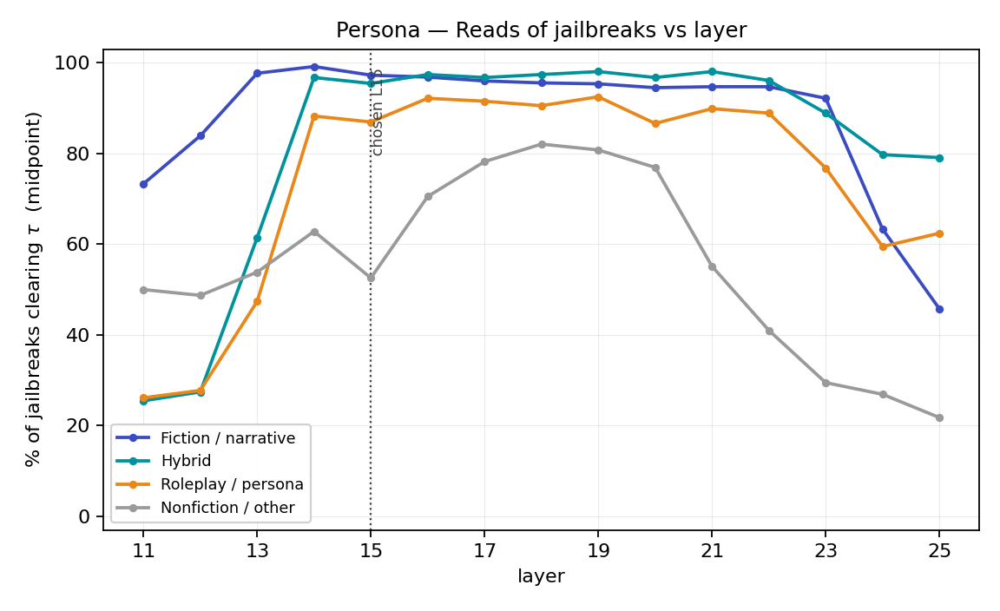
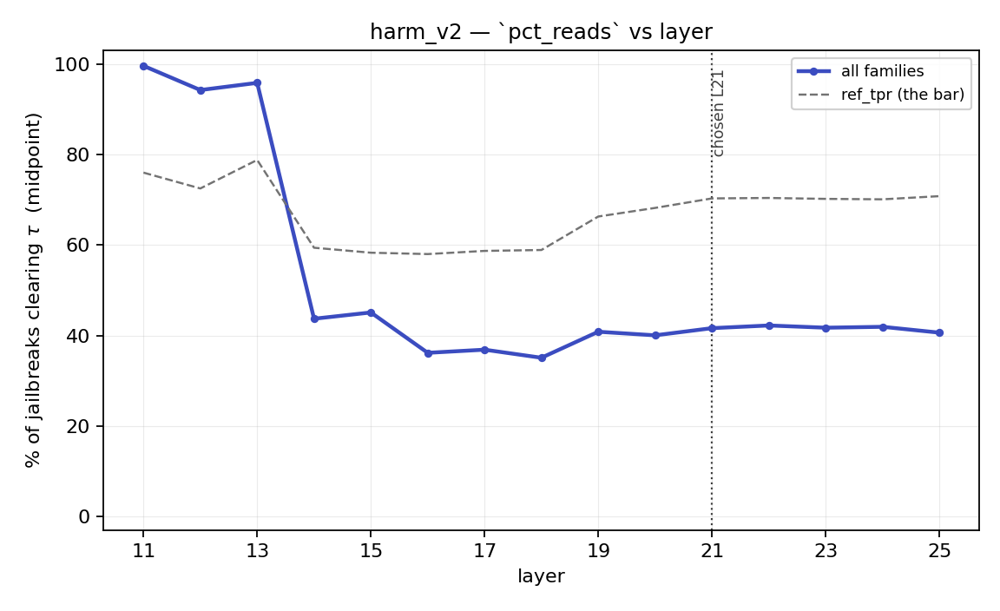
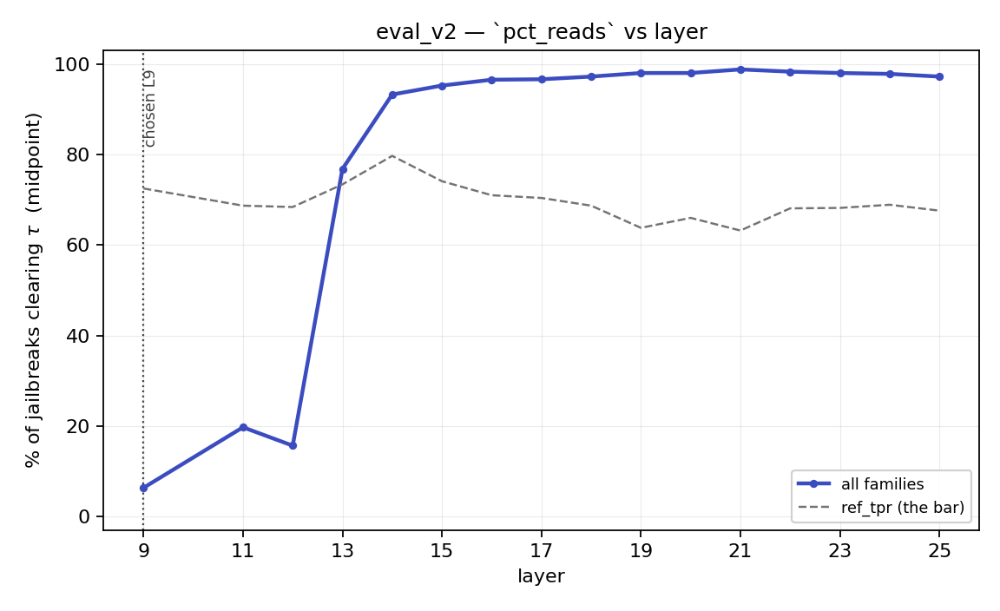

# probe_jailbreak_detection — insights

## 50_per_direction - midpoint

Qwen2.5-7B-Instruct, 100 jailbreak prompts, band L11–25, threshold = `midpoint`.

Results:
- Story v1: With these few at least and the midpoint threshold, the story_v1 does not activate in any layer 

- Story v2: The layers of story_v2 with the highest mean_paired_cos activate the most on fiction_narrative jailbreaks and they don't in nonfiction and roleplay, but still the mean pct_reads is only 34%
	Meanwhile, the layers of story_v2 which most activate on fiction_narrative, also activate the same on nonfiction

- Persona: the layer with the highest pct_reads (layer 17) cannot distinguish nonfiction prompts (but activates on fiction_narrativity and hybrid)

- Eval: The eval direction almost always activates in most layers

- Harm: it activates more on early layers rather than the layers with highest mean_paired_cos

These results in general suggests that the probes are not good enough and that it may be necessary to calibrate the threshold per direction and have a better criteria for layer selection

### layer selection by family margin

`jb_layer_select.py`: per layer, `margin = mean(pct_reads over target families) −
mean(pct_reads over off families)`, families weighted equally. Top-3 band layers:

| probe | targets | top-3 layers (margin) |
|---|---|---|
| story_v1 | fiction_narrative + hybrid | L15 (+9.6), L20 (+8.2), L16 (+6.8) |
| story_v2 | fiction_narrative + hybrid | L17 (+30.0), L18 (+27.4), L15 (+22.1) |
| persona | hybrid + roleplay_persona | L19 (+26.0), L21 (+19.8), L22 (+19.6) |

Reading it:

- **story_v1** — the ranking is noise: the best layer reads 14% of fiction and 5% of
  hybrid, so the margin is a handful of prompts.
- **story_v2** — L17 is the only clean cell (40/30% on target, 0/10% off) and it is also
  a top-3 `mean_paired_cos` layer. L18 ranks second on margin but fires on everything
  (nonfiction 20%, roleplay 37%), so the margin there is a level shift, not selectivity.
- **persona** — every top layer still reads 77–91% of `fiction_narrative`, i.e. the
  margin comes entirely from suppressing `nonfiction_other`. The axis separates framed
  from unframed, not persona from story.

### story_v2

Top-3 `mean_paired_cos` layers: L16 (0.776), L15 (0.775), L17 (0.772).

| slice | pct_reads | n | n_reads | ref_tpr |
|---|---|---|---|---|
| all | 19.0% | 100 | 19.0 | 1.000 |
| fiction_narrative | 34.3% | 35 | 12.0 | 1.000 |
| hybrid | 21.7% | 20 | 4.3 | 1.000 |
| nonfiction_other | 0.0% | 15 | 0.0 | 1.000 |
| roleplay_persona | 8.9% | 30 | 2.7 | 1.000 |

Layer with highest `pct_reads` per slice:

| slice | layer | pct_reads | n | n_reads | ref_tpr |
|---|---|---|---|---|---|
| all | L19 | 72.0% | 100 | 72 | 1.000 |
| fiction_narrative | L19 | 60.0% | 35 | 21 | 1.000 |
| hybrid | L21 | 100.0% | 20 | 20 | 1.000 |
| nonfiction_other | L21 | 66.7% | 15 | 10 | 1.000 |
| roleplay_persona | L19 | 83.3% | 30 | 25 | 1.000 |

### story_v1

Top-3 `mean_paired_cos` layers: L16 (0.767), L15 (0.758), L14 (0.753).

| slice | pct_reads | n | n_reads | ref_tpr |
|---|---|---|---|---|
| all | 4.0% | 100 | 4.0 | 1.000 |
| fiction_narrative | 9.5% | 35 | 3.3 | 1.000 |
| hybrid | 3.3% | 20 | 0.7 | 1.000 |
| nonfiction_other | 0.0% | 15 | 0.0 | 1.000 |
| roleplay_persona | 0.0% | 30 | 0.0 | 1.000 |

Layer with highest `pct_reads` per slice:

| slice | layer | pct_reads | n | n_reads | ref_tpr |
|---|---|---|---|---|---|
| all | L25 | 7.0% | 100 | 7 | 1.000 |
| fiction_narrative | L15 | 14.3% | 35 | 5 | 1.000 |
| hybrid | L15 | 5.0% | 20 | 1 | 1.000 |
| nonfiction_other | L25 | 13.3% | 15 | 2 | 1.000 |
| roleplay_persona | L18 | 3.3% | 30 | 1 | 1.000 |

### harm

Top-3 `mean_paired_cos` layers: L21 (0.708), L22 (0.691), L20 (0.688).

| slice | pct_reads | n | n_reads | ref_tpr |
|---|---|---|---|---|
| all | 52.3% | 100 | 52.3 | 0.892 |
| fiction_narrative | 57.1% | 35 | 20.0 | 0.892 |
| hybrid | 63.3% | 20 | 12.7 | 0.892 |
| nonfiction_other | 17.8% | 15 | 2.7 | 0.892 |
| roleplay_persona | 56.7% | 30 | 17.0 | 0.892 |

Layer with highest `pct_reads` per slice:

| slice | layer | pct_reads | n | n_reads | ref_tpr |
|---|---|---|---|---|---|
| all | L11 | 100.0% | 100 | 100 | 0.800 |
| fiction_narrative | L11 | 100.0% | 35 | 35 | 0.800 |
| hybrid | L11 | 100.0% | 20 | 20 | 0.800 |
| nonfiction_other | L11 | 100.0% | 15 | 15 | 0.800 |
| roleplay_persona | L11 | 100.0% | 30 | 30 | 0.800 |

### persona (role-play)

Top-3 `mean_paired_cos` layers: L12 (0.707), L11 (0.703), L13 (0.699).

| slice | pct_reads | n | n_reads | ref_tpr |
|---|---|---|---|---|
| all | 49.0% | 100 | 49.0 | 0.990 |
| fiction_narrative | 71.4% | 35 | 25.0 | 0.990 |
| hybrid | 46.7% | 20 | 9.3 | 0.990 |
| nonfiction_other | 46.7% | 15 | 7.0 | 0.990 |
| roleplay_persona | 25.6% | 30 | 7.7 | 0.990 |

Layer with highest `pct_reads` per slice:

| slice             | layer | pct_reads | n   | n_reads | ref_tpr |
| ----------------- | ----- | --------- | --- | ------- | ------- |
| all               | L18   | 94.0%     | 100 | 94      | 0.892   |
| fiction_narrative | L16   | 100.0%    | 35  | 35      | 0.923   |
| hybrid            | L18   | 100.0%    | 20  | 20      | 0.892   |
| nonfiction_other  | L18   | 93.3%     | 15  | 14      | 0.892   |
| roleplay_persona  | L17   | 90.0%     | 30  | 27      | 0.908   |
|                   |       |           |     |         |         |

persona at L17, per family:

| slice | pct_reads | n | n_reads | ref_tpr |
|---|---|---|---|---|
| all | 87.0% | 100 | 87 | 0.908 |
| fiction_narrative | 94.3% | 35 | 33 | 0.908 |
| hybrid | 95.0% | 20 | 19 | 0.908 |
| nonfiction_other | 53.3% | 15 | 8 | 0.908 |
| roleplay_persona | 90.0% | 30 | 27 | 0.908 |

### eval

Top-3 `mean_paired_cos` layers: L14 (0.332), L15 (0.325), L16 (0.318).

| slice | pct_reads | n | n_reads | ref_tpr |
|---|---|---|---|---|
| all | 94.3% | 100 | 94.3 | 0.779 |
| fiction_narrative | 92.4% | 35 | 32.3 | 0.779 |
| hybrid | 100.0% | 20 | 20.0 | 0.779 |
| nonfiction_other | 100.0% | 15 | 15.0 | 0.779 |
| roleplay_persona | 90.0% | 30 | 27.0 | 0.779 |

Layer with highest `pct_reads` per slice:

| slice | layer | pct_reads | n | n_reads | ref_tpr |
|---|---|---|---|---|---|
| all | L19 | 99.0% | 100 | 99 | 0.692 |
| fiction_narrative | L19 | 97.1% | 35 | 34 | 0.692 |
| hybrid | L14 | 100.0% | 20 | 20 | 0.785 |
| nonfiction_other | L14 | 100.0% | 15 | 15 | 0.785 |
| roleplay_persona | L19 | 100.0% | 30 | 30 | 0.692 |

---

## 1K_per_direction

- The threshold (midpoint or gap mid) does not matter much
- The chosen layers are not the ones who best detect the jailbreaks they should, although story v2 does keep the expected ranking
- A possible new config could take the vectors from the layers who best detect the corresponding jailbreaks instead of using cohens

Qwen2.5-7B-Instruct, **all 1,009** jailbreak prompts, one chosen layer per direction, both
thresholds. `ref_tpr` is per probe × layer, so it is constant down each table by construction —
near 1.0 the bar is passable and a low `pct_reads` is a real finding; low `ref_tpr` means τ is too
strict to conclude anything.

### `story_v2_1k` — L23

| family | n | midpoint | gap_mid | ref_tpr (mid / gap) |
|---|---|---|---|---|
| **all** | 1009 | **19.1%** | **12.8%** | 0.992 / 0.980 |
| fiction_narrative | 472 | 33.9% | 23.7% | 0.992 / 0.980 |
| hybrid | 153 | 8.5% | 6.5% | 0.992 / 0.980 |
| roleplay_persona | 306 | 5.9% | 2.3% | 0.992 / 0.980 |
| nonfiction_other | 78 | 2.6% | **0.0%** | 0.992 / 0.980 |

The only direction whose families come out **monotone in the intended order**, at both thresholds:
fiction 13× nonfiction at `midpoint`, and nonfiction goes to zero at `gap_mid`. Its bar is also the
only passable one (`ref_tpr` 0.99), so the low absolute level is a finding rather than an artefact —
two thirds of fiction-framed jailbreaks still do not read as story.

### `persona_v2` — L15

| family | n | midpoint | gap_mid | ref_tpr (mid / gap) |
|---|---|---|---|---|
| **all** | 1009 | **90.4%** | **88.2%** | 0.939 / 0.926 |
| fiction_narrative | 472 | 97.2% | 97.2% | 0.939 / 0.926 |
| hybrid | 153 | 95.4% | 95.4% | 0.939 / 0.926 |
| roleplay_persona | 306 | 86.9% | 80.1% | 0.939 / 0.926 |
| nonfiction_other | 78 | 52.6% | 51.3% | 0.939 / 0.926 |

Reads ~everything, and reads **fiction above roleplay** — backwards for a persona axis. The 50-pair
read stands at 10× the n: it separates framed from unframed, not persona from story. `nonfiction_other`
at ~52% is the only slice it declines, and `ref_fpr` is 0.10, so a tenth of its own negative pole
clears the same bar.

### `harm_v2` — L21

| family | n | midpoint | gap_mid | ref_tpr (mid / gap) |
|---|---|---|---|---|
| **all** | 1009 | **41.6%** | **50.5%** | 0.703 / 0.737 |
| hybrid | 153 | 73.2% | 84.3% | 0.703 / 0.737 |
| roleplay_persona | 306 | 64.7% | 79.4% | 0.703 / 0.737 |
| nonfiction_other | 78 | 38.5% | 59.0% | 0.703 / 0.737 |
| fiction_narrative | 472 | 16.9% | 19.5% | 0.703 / 0.737 |

**`ref_tpr` 0.70 — the bar rejects 30% of its own positive pole**, so these cells are the weakest
evidence in the table. Reads fiction *least* of the four families, and is the one direction where the
two thresholds diverge materially (+9 overall, +20 on nonfiction): τ moves −0.81 → −8.87, i.e. the
pole means and the pole quantiles disagree about where the boundary is.

### `eval_v2` — L9

| family | n | midpoint | gap_mid | ref_tpr (mid / gap) |
|---|---|---|---|---|
| **all** | 1009 | **6.3%** | **8.3%** | 0.725 / 0.782 |
| fiction_narrative | 472 | 10.8% | 13.3% | 0.725 / 0.782 |
| nonfiction_other | 78 | 7.7% | 14.1% | 0.725 / 0.782 |
| hybrid | 153 | 2.6% | 2.6% | 0.725 / 0.782 |
| roleplay_persona | 306 | 1.0% | 2.0% | 0.725 / 0.782 |

At L9 it reads almost nothing — and at L13–25 it reads **77–99%**. `ref_fpr` is 0.27. The chosen layer
is doing all the work; see below.

### `pct_reads` vs layer

`midpoint` throughout. Dashed grey is `ref_tpr` on the same axis — it is also a percentage of a set
clearing the same τ, and where it sags the curve above it is not a statement about jailbreaks.

**`story_v2_1k` has three regimes, and the chosen layer is in none of the good one.** L14–18 is
selective: fiction 41–68% while `nonfiction_other` sits at **0.0%** through L17. L19–21 is a level
shift that fires on everything — hybrid overtakes fiction (77% vs 55% at L21) and nonfiction reaches
32%. L22–25 decays, and L23 is on that tail. Margin = fiction − mean(other three):

| | L14 | **L15** | L16 | **L17** | L18 | L19 | L21 | **L23** | L25 |
|---|---|---|---|---|---|---|---|---|---|
| fiction | 40.9 | 62.5 | 52.1 | 63.1 | 67.6 | 62.1 | 55.3 | 33.9 | 7.4 |
| nonfiction | 0.0 | 0.0 | 0.0 | 0.0 | 5.1 | 30.8 | 32.1 | 2.6 | 0.0 |
| **margin** | +39.6 | **+57.3** | +49.1 | **+55.8** | +50.4 | +9.9 | +3.2 | +28.3 | +5.3 |

L23 costs about half the sensitivity *and* half the selectivity of L15/L17. And the top three layers
by margin are **L15, L17, L18 — the same three the 50-pair `jb_layer_select` picked**, at roughly
double the margin, so this is a replication and not a large-n artefact.

**`persona_v2` never becomes a persona detector at any layer.** Its own margin
(roleplay+hybrid − fiction+nonfiction) is *negative* at L11–13 and peaks at only +37 at L25, where
every curve is collapsing; fiction − nonfiction is positive at all 15 layers. Its `ref_tpr` also
decays from 0.98 at L14 to 0.84 by L18, so the flat 90%+ plateau is partly the bar sliding down.

**`harm_v2` and `eval_v2` are step functions, not curves.** `harm_v2` reads 94–100% at L11–13 and
~40% thereafter; `eval_v2` reads 6–20% at L9–12 and 93–99% from L14. Both steps land where `ref_tpr`
is 0.6–0.8, i.e. the transition is the threshold moving, not the axis appearing.

### The layer decides the answer, the threshold does not

Switching threshold moves the `all` row by ≤9 points, and no family slice by more than 21
(`harm_v2` / `nonfiction_other`). Switching layer moves `eval_v2` from 6% to 99%, `story_v2_1k` from
0% to 68% on fiction, and `story_v2_1k`'s selectivity margin from +3 to +57. **The
`midpoint`-vs-`gap_mid` comparison this tag was built around is the small effect.**

`gap_mid` is also not the max-margin cut it is documented as: `gap_position` is `nan` for
`persona_v2`, `harm_v2` and `eval_v2`, i.e. p5(pos) < p95(neg) and there is **no empty gap** for τ to
sit inside. Only `story_v2_1k` has one (τ at +0.25 of it).

### Findings

- **`story_v2_1k` is the only probe that discriminates jailbreak framing**, and it does so in the
  right order at both thresholds. It is also the only one with a passable bar.
- **The chosen layers are wrong for this task.** `cohens_dz_train` on the extraction poles put story
  at L23; on jailbreaks L15/L17 double both its sensitivity and its selectivity. Note which criterion
  survives: extraction's `mean_paired_cos` peak was **L16**, and extraction flagged the d_z-vs-mpc
  disagreement (L23 vs L16, "~7 layers") as a property of the axis. On this task mpc is the one that
  transfers. Picking a layer off these curves would be selecting on the test set, so the finding is
  about the *criterion*, not a new layer to adopt.
- **The 100-row subset was representative.** `story_v2_1k` reads 19.1% overall / 33.9% fiction here
  against 19.0% / 34.3% at 50_per_direction — 10× the prompts and a different layer, same answer. The
  extra 909 rows bought resolution on the slices, not a different headline.
- **Source explains more than family for `harm_v2` and `story_v2_1k`.** `harm_v2` reads
  `in_the_wild` at 76% and `jailbreak_mimicry` at **0%** (n=300); `story_v2_1k` reads
  `jailbreak_mimicry` at 50% and `in_the_wild` at 8%. Family and source are confounded, and neither
  table separates them.
- **`deep_inception` (n=57) reads 0% on `story_v2_1k`** at both thresholds, despite being nested-scene
  fiction by construction — the one family-level prediction that fails outright.
- **`harm_v2` and `eval_v2` are not usable at their chosen layers** on this task: `ref_tpr` 0.70/0.73
  and `ref_fpr` 0.11/0.27.

### Caveats

- **No `length` foil at this tag**, so the confound the 50-pair run found is neither confirmed nor
  cleared. Jailbreaks are a median 1,013 chars against ~70-word pole prompts, and `persona_v2`'s
  ~90%-everything pattern is exactly what a length reader would produce.
- τ is calibrated **off-distribution** in every cell, which is what the two `ref_*` columns are for.
- Effective *n* is far below 1,009 under §0.7 clustering: 424 wrappers, and 300 `jailbreak_mimicry`
  rows share 2 of them.
- `eval_v2`'s L9 is outside the band, so its row has no band context at the layer its cells are read.
